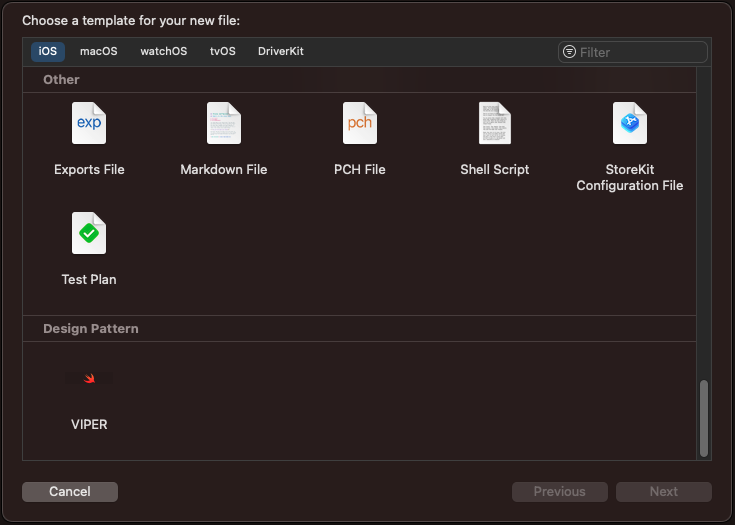

# VIPER Template
 Automatic file generator with design pattern from a module name

## How to install?
1. Download `install_template.sh` file
1. Install with `sh install_template.sh` in terminal

## How to use?
1. Go to Xcode Project

1. New file > Design Pattern > VIPER

 

1. Write module name

1. READY!

